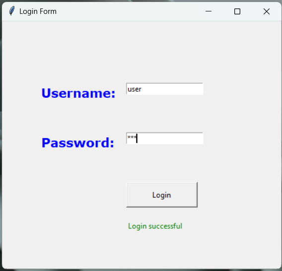
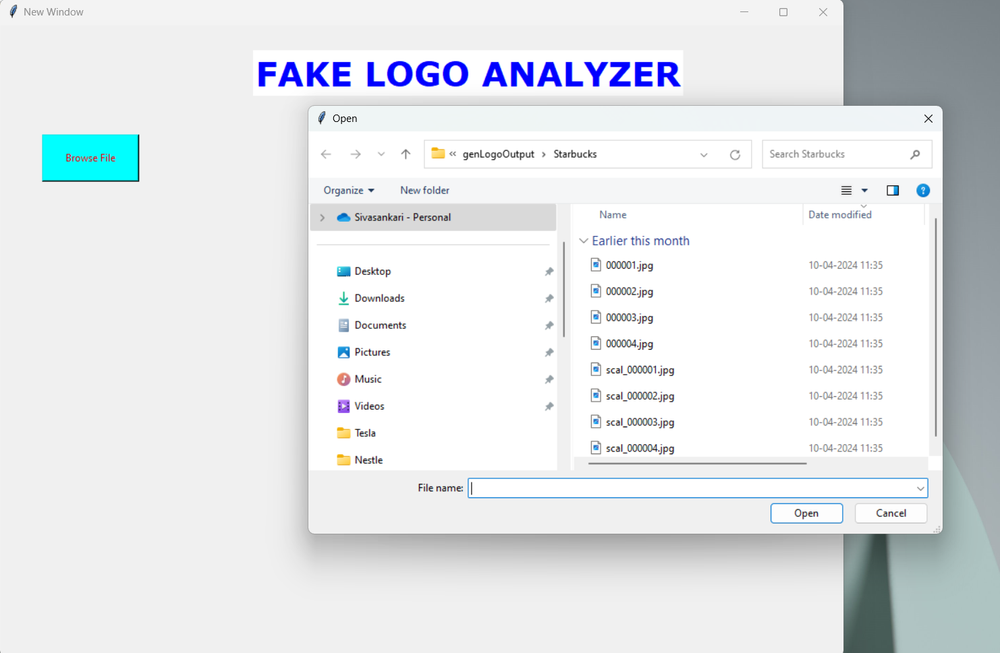
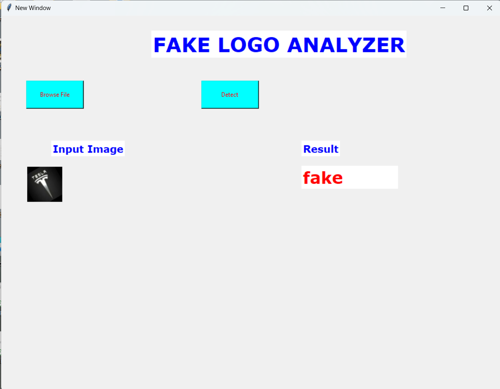

# Fake-logo-classification-using-Machine-Learning-Neural-Network-
The project - Fake logo classification using Machine Learning  (Neural Network), aims on classifying the input logos as genuine or fake, to avoid consumer deception. The model works bsed on a Resnet50 Neural Networking model.

A python based user – friendly graphical interface that classifies input images through a neural network model, to differentiate between genuine and fake logo images. It aims to safeguard brands, and consumers in the market by mitigating risks associated with infringement and consumer deception. All user logins are authorised to prevent any possible data corruption. 

**Instructions:**
- Open the program - cde.py - locally, as Tkinter is not supported through GitHub. 
- Install the required libraries, like, torch and torchvision, if not installed in the computer already.
- Run the code
- Login as:
  - *Username:* user
  - *Password:* abc
  
**Login Page:**

- Once the Fake Logo Analyzer window is open, click on the Browse File button to browse through files to select an input file

**You will get the following window:**

  
- After selecting, click on Detect, which enables the program to classify your given input, and it displays it.

**Output:**

**Note:** Any number of classifications can be performed, that is the program stops only when the windows are closed.

**Team Details:**
**- Members and contributions:**
  - Sivasankari Srinath Thilagavathi – 122301037
    - Data Collection and Labelling
    - Model training and creation of the epoch500 .pth file
    - Classification using the built model
  - Jalagam Varshitha - 112301011:
    - Proposal of Problem Statement
    - Data Segregation
    - Login Authentication using GUI
  - Abothu Varsha - 112301002: 
    - Data Labelling 
    - Data segregation
    - GUI for main window
   
  File Structure:
- cde.py – source code
- logo_classification_model_epoch500.pth – model
- modified_csv_file.csv – file containing label for all input training data samples
- output and genLogoOutput folders – contains images for training and testing

    

